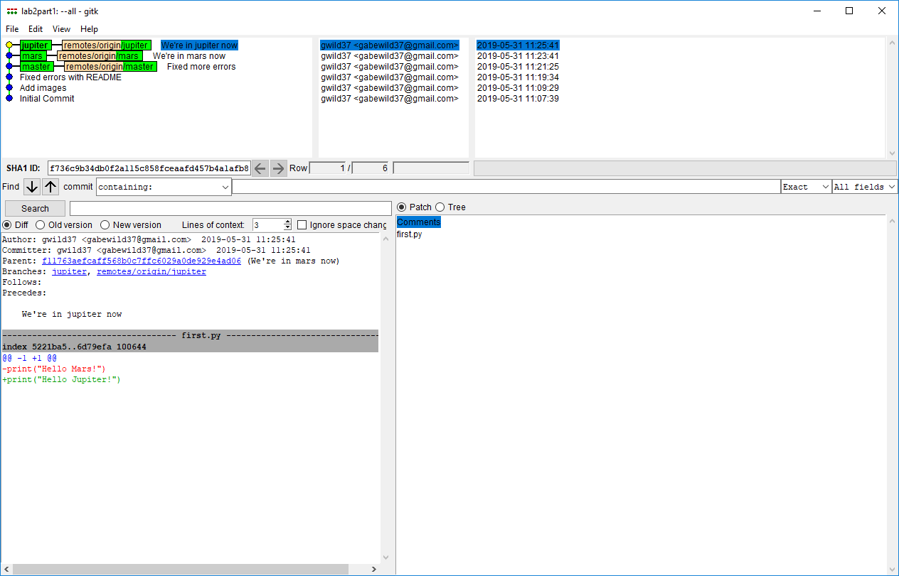
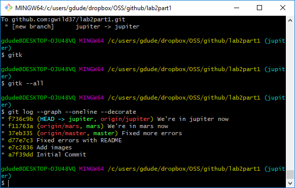

# lab2.md
[lab2part1](https://github.com/gwild37/lab2part1)

[Spoon-Knife](https://github.com/gwild37/Spoon-Knife)

[PullReq](https://github.com/wdturner/PullReq)
[PullReqFork](https://github.com/gwild37/PullReq)

[OSSProjectIdeas](https://github.com/beshaz/OSSProjectIdeas)
